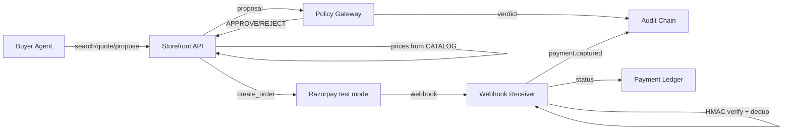

# SELLABLE

[](https://github.com/HarshDubey23/SELLABLE/actions/workflows/ci.yml)

SELLABLE — agent-readable, agent-transactable, agent-safe merchant on Razorpay test mode.

## Quick start

```bash
cp .env.example .env   # fill in: RAZORPAY_KEY_ID, RAZORPAY_KEY_SECRET,
                       # RAZORPAY_WEBHOOK_SECRET, MISSION_HMAC_KEY
make install
make run               # starts uvicorn on :8000
make smoke             # 8 verifications, all PASS
```

## Architecture



**Storefront API** (`apps/api/tools.py`, `manifest.py`, `products.py`).
The agent-facing surface: a machine-readable manifest at
`/.well-known/agent-manifest.json`, catalog search and product lookup
over 40 hand-authored SKUs (with adversarial injection payloads planted
in descriptions — on purpose), signed quotes with a 30-minute TTL,
order creation against real Razorpay test mode, and payment status.
Prices are always computed server-side from the catalog; nothing a
client sends can change what an order costs.

**Policy Gateway** (`apps/api/gateway/`). Pure rule functions that decide
whether a buyer-agent proposal may become money movement: budget caps,
category allowlists, upsell limits, signature and expiry checks. No LLM
imports, no I/O in the decision path — same inputs, same verdict, always.
Day 3 completes R1–R10; today R1/R9/R10 are green as scaffolding.

**Audit Chain + Webhook** (`apps/api/audit/chain.py`, `webhook/receiver.py`).
Every consequential action (verdict emitted, order created, payment
captured) appends to a hash-chained ledger that self-verifies at boot.
Incoming Razorpay webhooks verify HMAC on the raw body before parsing,
dedupe on `X-Razorpay-Event-Id`, and apply a status hierarchy so
out-of-order events never downgrade the payment ledger.

## Endpoints

Interactive API docs at `/docs` when the server is running.

| Route | What it does |
|---|---|
| `GET /health` | Liveness + chain verification status |
| `GET /.well-known/agent-manifest.json` | Agent-readable manifest: tools, policies, payment |
| `GET /tools/search_products` | Catalog search (query / category / max price) |
| `GET /tools/get_product/{sku}` | Single product, catalog truth |
| `GET /tools/merchant_policy` | Returns/shipping/cancellation/upsell policy |
| `POST /tools/quote` | Server-computed, HMAC-signed quote (30-min TTL) |
| `POST /tools/submit_proposal` | Proposal evaluation via the policy gateway |
| `GET /tools/explain_reject` | Human-readable rejection reason |
| `POST /tools/create_order` | Razorpay test-mode order (idempotent) |
| `GET /tools/check_payment/{order_id}` | Payment status from the ledger |
| `POST /webhook` | Razorpay webhook: HMAC verify + event dedup |
| `GET /ledger` | Payment ledger |
| `GET /policy` | The 10 gateway rules, machine-readable |
| `GET /audit` | Full audit chain (JSON) + live verification |
| `GET /audit/timeline` | Audit chain as an HTML card timeline |
| `GET /gateway/proof` | Machine-provable gateway purity report + source SHA-256 |
| `GET /demo/injection/{n}` | Injection attack I1-I8 and the verdict that kills it |

## Philosophy

[Why no LLM decides money](docs/PHILOSOPHY.md) — LLM proposes,
deterministic policy disposes, audit log remembers.

## Docs

- [docs/blueprint.md](docs/blueprint.md) — full build spec
- [docs/log/](docs/log/) — daily engineering logs

**Status:** Day 2 complete: storefront + signed quotes + webhook idempotency. Gateway R1/R9/R10 green, 7 rules to go (Day 3).
