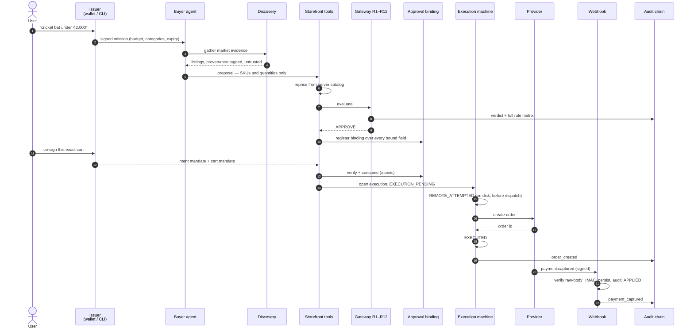
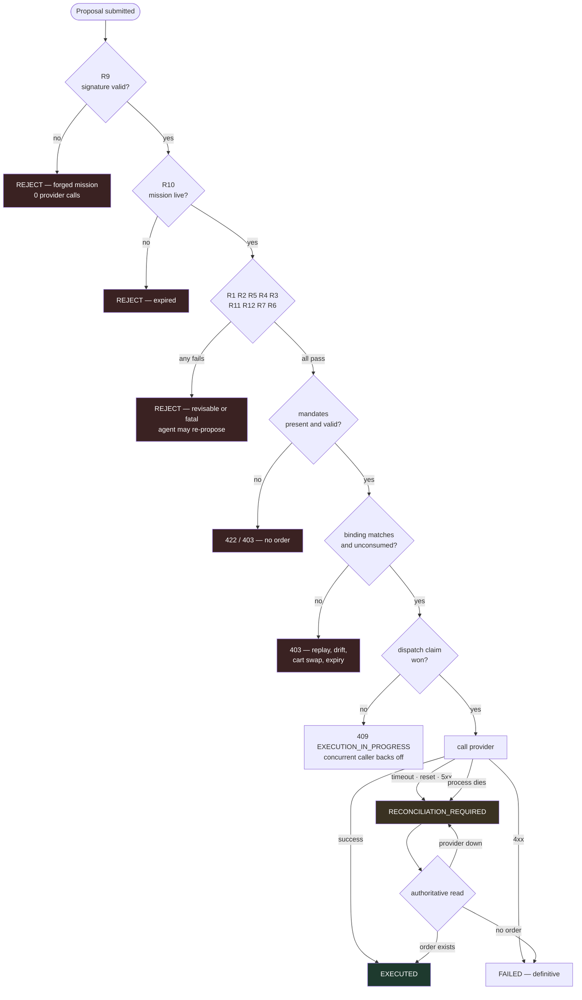

# End to end

One mission, from a sentence to a settled payment, with every branch that
can actually happen.

## The happy path

## Every branch that can fire

Every rejection path above appends to the audit chain with its rule id or
error code, so a refusal is as traceable as a success.

## Where each branch is tested

| Branch | Test |
|---|---|
| R9 forged signature | `tests/gateway/test_r9_signature.py` |
| R10 expiry | `tests/gateway/test_r10_expiry.py` |
| R1 budget, R3 drift, R2/R5 scope | `tests/gateway/test_matrix.py`, `tests/security/` |
| Every bound field of the binding | `tests/gateway/test_binding_field_matrix.py` |
| Replay of a consumed binding | `tests/gateway/test_binding_field_matrix.py` |
| Concurrent execution | `tests/execution/test_execution_e2e.py` |
| Timeout → reconcile → EXECUTED | `tests/execution/test_execution_e2e.py` |
| Lost request → reconcile → FAILED | `tests/execution/test_execution_e2e.py` |
| Crash mid-flight → recovery | `tests/execution/test_execution_state_machine.py` |
| Webhook duplicate, crash window | `tests/test_webhook_crash_recovery.py` |
| Chain tamper halts the money path | `tests/test_audit_chain_true_tamper.py` |
