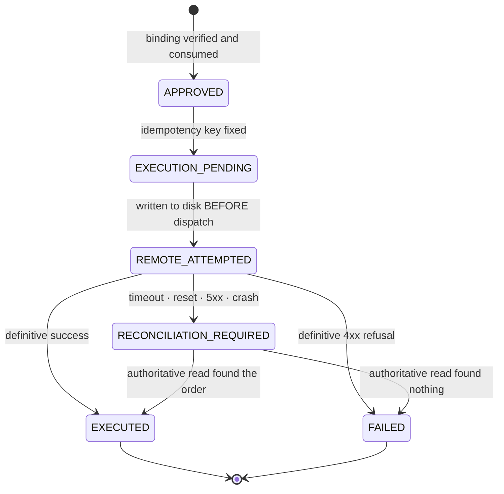
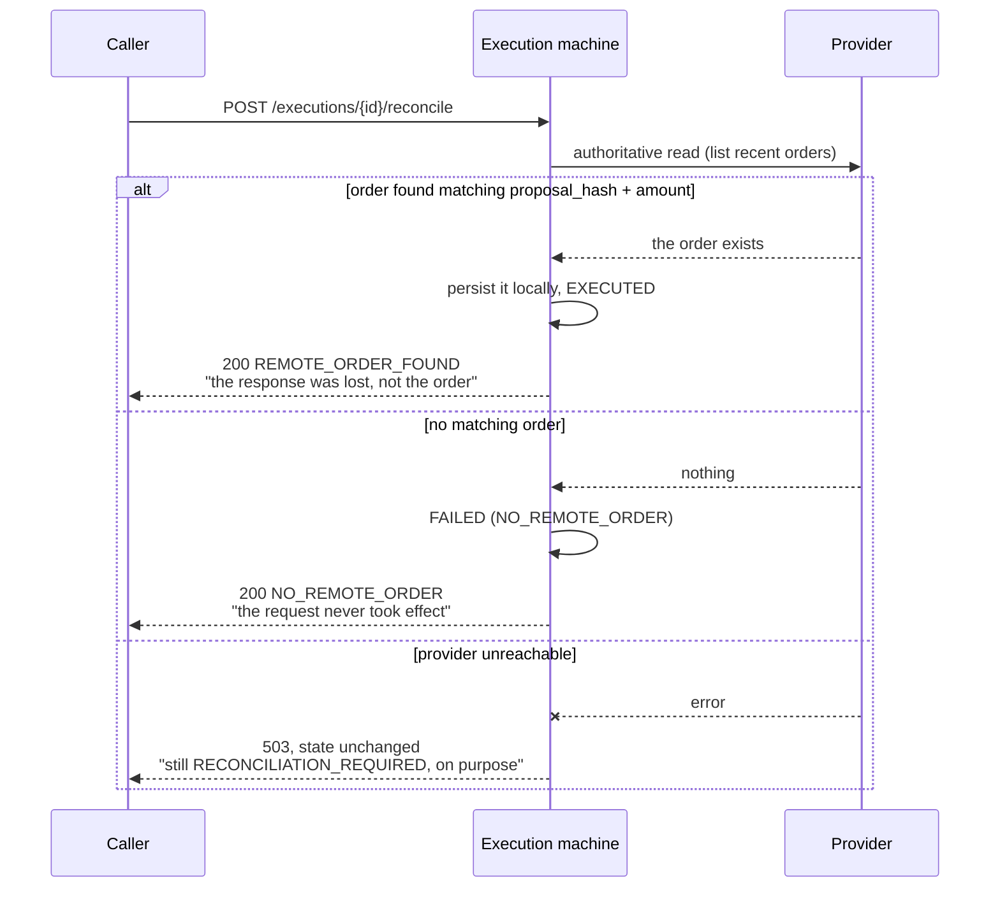

# Execution lifecycle

## The question this answers

> "Your agent calls Razorpay. The call times out. What happens?"

Most answers to that question are wrong in one of two ways. Treat the
timeout as a failure and retry, and you double-charge someone. Treat it
as a success, and you ship goods nobody paid for.

A timeout is neither. It is an **unknown**, and the only correct response
is to record it durably as unknown and then resolve it against the one
system that knows: the provider.

## The states



Terminal states are absorbing. `tests/execution/test_execution_state_machine.py`
asserts that every transition outside this table raises, and that a
concurrent writer cannot apply the same transition twice — each move is a
conditional `UPDATE ... WHERE state = ?`.

## Why the write ordering is the whole design

```
  ex.transition(execution_id, REMOTE_ATTEMPTED)   <-- committed to SQLite
  provider.create_order(...)                      <-- the network call
```

If the process dies between those two lines, the row on disk says
`REMOTE_ATTEMPTED`. At the next boot, `recover_stranded()` sweeps every
such row into `RECONCILIATION_REQUIRED`.

Had we written the state *after* the call, a crash would leave the row at
`EXECUTION_PENDING` — indistinguishable from "we never dispatched" — and
an orphaned order at Razorpay that nothing would ever look for.

`EXECUTION_PENDING` rows are deliberately left alone by recovery: they
were never dispatched, so they are safe.

## What reconciliation actually does



The third branch matters. If we cannot read authoritative state, we
cannot conclude anything, so the row stays stuck and visible. A system
that resolves ambiguity by guessing when the provider is down has
replaced one silent failure with a louder one.

**Honest limitation:** Razorpay exposes no public "fetch by idempotency
key" lookup, so reconciliation pages recent orders and matches on
correlation fields (`proposal_hash`, amount) that we wrote into the
order's `notes` at creation. This works, and it is the reason those notes
exist — but a provider that dropped `notes` would defeat it, and at very
high order volume the paging window would need to be bounded by time
rather than count.

## Idempotency that does not depend on a header

`execution_id = sha256(mission_id | proposal_hash | approve_seq)`.

The same authorized intent always maps to the same row, regardless of
what the client sends in `X-Idempotency-Key`. The row is claimed with a
single `INSERT` against a primary key, so concurrent callers cannot both
open one. What each caller gets back:

| Existing state | Response |
|---|---|
| none | proceeds |
| `EXECUTED` | `200` with the original order id, `duplicate: true` |
| `REMOTE_ATTEMPTED` / `RECONCILIATION_REQUIRED` | `409` — reconcile first, do not retry |
| `FAILED` | `409` — this authorization is spent; get a new approval |
| `APPROVED` / `EXECUTION_PENDING` | resumes; the dispatch claim decides the winner |

We send `X-Razorpay-Idempotency-Key` as well, but we do not rely on it.
Local durable state plus reconciliation is the guarantee; the header is
defence in depth.

## Seeing it happen

With the simulated provider (no Razorpay credentials configured), the
failure modes are reachable through an explicit, refused-on-live header:

```bash
# The provider applied the write, then the response was lost.
curl -X POST localhost:8000/tools/create_order \
     -H "X-Sellable-Fault: remote_timeout" ...
# -> 202 RECONCILIATION_REQUIRED

curl -X POST localhost:8000/executions/{execution_id}/reconcile ...
# -> 200 REMOTE_ORDER_FOUND, state EXECUTED

# The request never reached the provider.
# -> X-Sellable-Fault: remote_lost, then reconcile -> FAILED, no money moved
```

`X-Sellable-Fault` returns `400 FAULT_INJECTION_REFUSED` whenever a real
provider is configured, so it cannot be used against live credentials.

## Coverage

`tests/execution/` — 27 tests over the transition table, deterministic
ids, concurrent claiming, crash recovery, both reconciliation outcomes,
retry refusal after an ambiguous outcome, and end-to-end runs through the
real HTTP surface.
