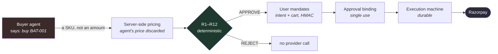

# Money safety

## The claim

> An LLM can be fully compromised — prompt-injected, hallucinating, or
> replaced with a hostile model — and it still cannot spend a rupee.

## Why it holds

Not because the model is well-behaved. Because the model is never asked
a question whose answer moves money.

The agent's entire vocabulary at the money boundary is *"this SKU, this
quantity"*. Amounts, currencies, merchants and totals are all computed
server-side. There is no message the agent can send that means "pay
₹50,000", because that sentence has no representation in the interface.

## The five gates, and what each one actually stops

**1. Signed mission.** The budget, allowed categories and expiry are
HMAC-signed by the issuer. `R9_SIGNATURE` fails closed: no key or no
signature means reject, never trust. An agent cannot widen its own budget
because it cannot forge the signature over the widened one.

**2. Server-side pricing.** `tools.submit_proposal` overwrites every
price from the catalog. A proposal that claims a different price is then
caught by `R3_PRICE_DRIFT` at ±0 paise. Two independent mechanisms,
because this is the attack that a scraped-listing pipeline most invites.

**3. Deterministic gateway.** Twelve rules, evaluated in phases, first
violation wins, fail-closed on any missing input. No LLM call, no network
call, no file I/O — enforced by an import test, not by convention.

**4. User mandates.** Even after the gateway approves, the executor
requires an `IntentMandate` (the user pre-authorized this ceiling) and a
`CartMandate` (the user co-signed *this exact cart* at *this exact
amount*). Signed with a key the agent module never reads.

**5. Approval binding.** The APPROVE verdict is turned into a hash over
mission, proposal, cart, quote, amount, currency and the exact SKU set.
Every field is load-bearing: `tests/gateway/test_binding_field_matrix.py`
changes each one in turn and asserts the specific refusal code. It is
consumed atomically — `UPDATE ... WHERE consumed_at IS NULL` — so under
concurrency exactly one caller can spend it.

## What this does not claim

The gateway protects the *money boundary*. It does not make the agent
correct. A compromised agent can still waste your time, recommend the
wrong bat, or refuse to work. It just cannot cost you money.

Custody has one honest caveat: missions and mandates are meant to be
signed out of band (`scripts/sign_mission.py`, `scripts/mandate.py`). The
browser demo path signs them in-process through `apps/api/issuer.py`, and
every response it produces carries `authorization_issued_by:
in_process_demo_issuer` so the weaker guarantee is visible rather than
implied. See [trust-boundary.md](trust-boundary.md).
