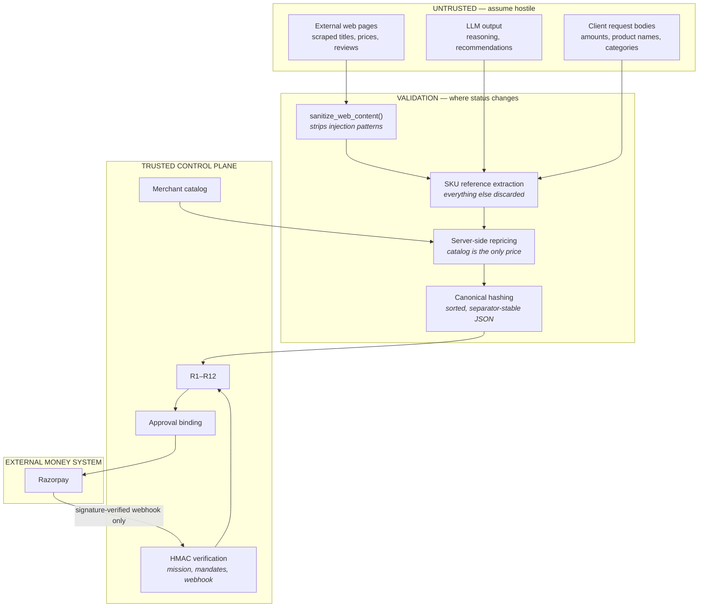

# Trust boundaries

## Where data changes status

## The one-sentence version

**Untrusted data may influence *which SKU* is proposed. It may never
influence *what that SKU costs*, *whether it is allowed*, or *whether the
payment happens*.**

## Where each check lives

| Boundary | Mechanism | Code |
|---|---|---|
| Web content → agent | pattern sanitisation | `growth/intelligence.py: sanitize_web_content` |
| Agent → proposal | SKU-only interface; prices overwritten from catalog | `tools.py: tool_submit_proposal` |
| Proposal → verdict | 12 deterministic rules, fail-closed | `gateway/engine.py` |
| Verdict → authorization | canonical hash over every bound field | `gateway/types.py`, `approval.py` |
| Authorization → money | atomic single-use consumption | `approval.py: verify` |
| Money → local state | durable execution machine | `execution.py` |
| Provider → local state | raw-body HMAC before parsing | `webhook/receiver.py` |

## The webhook boundary specifically

The signature is verified against the **raw request body**, before
`json.loads` is called on it. Parsing first and verifying the re-encoded
result is a classic way to make a signature check meaningless, since
re-encoding can change bytes.

An event is only considered processed once it reaches `APPLIED` on disk.
Persisting it is not enough — see [execution-lifecycle.md](execution-lifecycle.md)
for why, and `tests/test_webhook_crash_recovery.py` for the regression
that proves it.

## Evidence provenance

External listings are not simply "trusted" or "untrusted" — they carry
how much can be believed about each field:

| Class | Meaning |
|---|---|
| `OBSERVED` | an INR price appeared verbatim in the source |
| `FX_CONVERTED` | converted from another currency at a static reference rate — an estimate, `price_source_verified` stays false |
| `MOCK_SOURCE` | synthetic data from a mock API; excluded from market comparison entirely |
| `UNVERIFIED` | the source matched, but published no price |

The comparison surface only ever quotes `OBSERVED` prices, and phrases it
as *"the lowest INR price observed verbatim across the searched
sources"* — not *"the cheapest price on the internet"*, which nothing
here could support.

## Honest caveats

**In-process issuance.** `apps/api/issuer.py` signs missions and mandates
inside the server for the browser demo. That proves *integrity* (nothing
tampered with them in transit) but not *custody* (the same process could
have minted them). Every response from that path says
`authorization_issued_by: in_process_demo_issuer`. The `/tools/*` API
path takes externally signed missions and does not have this caveat.

**Single-node concurrency.** Single-use consumption and the execution
dispatch claim are conditional `UPDATE` statements against one SQLite
file. Correct for one process and one database; a multi-node deployment
would need the same guards at the database layer, which SQLite is the
wrong choice for.

**The storefront checkout carries no API key.** `/tools/*` is the agent
surface and is key-gated; `/discovery/checkout` is the customer surface
and is not, which is correct for a storefront but leaves it open to
anyone who can reach the server. It is still fully gated by the policy
gateway and the mandates — the worst outcome is an unwanted *valid*
order, not an unauthorized amount — but a real deployment needs a session
and a per-IP throttle in front of it.

**The catalog is the trust root.** Everything reduces to "the server-side
catalog price is correct". If an attacker can write to `products.py` or
the database, none of the above helps — which is the right place for the
trust to bottom out, but worth stating.
